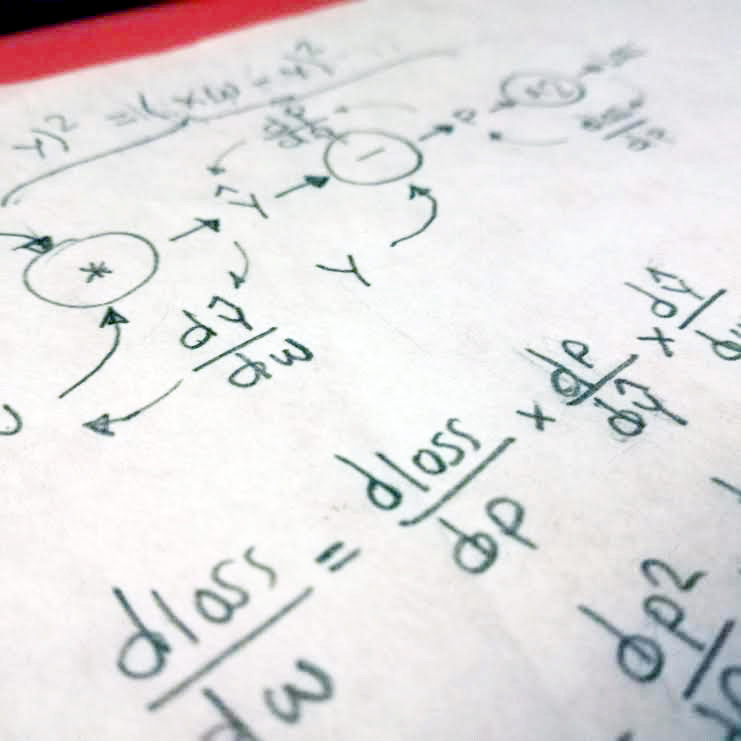

## Numpy TensorFlow Torch  
I am preparing a new tutorial some Machine Lerarning concepts. It will be very funny. I will use paper and pencil; but I will also use [Numpy](https://github.com/sandroormeno/Numpy_TensorFlow_Torch/blob/master/linear_regression_in_numpy_final.ipynb), [Pytorch](https://github.com/sandroormeno/Numpy_TensorFlow_Torch/blob/master/linear_regression_in_torch_final.ipynb) and some processes in [Tensorflow](https://github.com/sandroormeno/Numpy_TensorFlow_Torch/blob/master/linear_regression_in_TensorFlow_final.ipynb): like old school [code](https://github.com/sandroormeno/Numpy_TensorFlow_Torch/blob/master/linear_regression_in_TensorFlow_final_old_school.ipynb) until TF2.2 and [Tensorflow.Js](https://github.com/sandroormeno/Numpy_TensorFlow_Torch/blob/master/linear_regression_in_TensorFlowJs.html). And how could it be otherwise, I will reach the arduino environment. 

  

